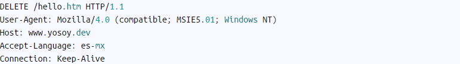

## Métodos HHTP

### GET

El método GET  solicita una representación de un recurso específico. Las peticiones que usan el método GET sólo deben recuperar datos.

- #### Ejemplo heeaders en el método GET 

> 

### HEAD

El método HEAD pide una respuesta idéntica a la de una petición GET, pero sin el cuerpo de la respuesta.

#### Ejemplo headers en el metodo HEAD

> 

### POST

El método POST se utiliza para enviar una entidad a un recurso en específico, causando a menudo un cambio en el estado o efectos secundarios en el servidor.

#### Ejemplo headers en el metodo POST

> 
> 

### PATCH

El método PATCH  es utilizado para aplicar modificaciones parciales a un recurso.
PATCH (al igual que POST) puede provocar efectos secundarios a otros recursos.

#### Ejemplo headers en el metodo PATCH

> 

### PUT

El modo PUT reemplaza todas las representaciones actuales del recurso de destino con la carga útil de la petición.

#### Ejemplo headers en el metodo PUt

> 

### DELETE

El método DELETE borra un recurso en específico.

#### Ejemplo headers en el metodo DELETE

> 

### OPTIONS

El método OPTIONS es utilizado para describir las opciones de comunicación para el recurso de destino.

#### Ejemplo headers en el metodo OPTIONS

> 

## Tipos de mensajes de las peticiones HTTP'S

A continuación se muestran los códigos de estado http y su significado. Estos códigos son abreviaturas de respuesta HTTP, da al cliente una manera sencilla de comprender el resultado de la transacción.

Se definen en el registro oficial de códigos de estado HTTP, especificado por RFC 2616 y  mantenidos por IANA.

Los códigos se clasifican en cinco grandes categorías, las cuales se identifican por el primer dígito del código de estado.

| Codigo | Tipo de respuesta |
|--------|-------------------|
| 1XX    | Respuestas informativas |
| 2XX    | Peticiones correctas |
| 3XX    | Redirecciones  |
| 4XX    | Errores del cliente|
| 5XX    | Errores de servidor|

- Los códigos de estado 1XX indican respuesta provisional, por lo que el servidor no envía respuesta a cliente, salvo para pruebas.

| Codigo  | Razón | Significado |
|---------|-------|-------------|
|100      |Continuar| Petición recibida y cliente debe continuar|
|101     | Cambio de protocolo|Indica que servidor ha cambiado de protocolo, especificado por cliente anteriormente|
|102    | Procesando| Usado en requests para reanudar peticiones abortadas|

- Los códigos de estado 2XX indican que se ha recibido la acción del cliente, aceptado y procesado.

| Codigo  | Razón | Significado |
|---------|-------|-------------|
| 202    | Aceptado| Petición aceptada pero no creada aun, no garantiza por parte de servidor|
| 203    | Información no autorizada| Indica que servidor intermedio tiene copia de recurso y no puede leer su meta-información|
| 204    | Sin contenido| Usado para refrescar navegador, mensaje sin cuerpo, solo header y Start Lines|
| 205   | Resetear contenido| Le dice que ponga en blanco campos de formulario en navegador|
| 206   | Contenido parcial| Indica que contenido parcial se ha entregado con éxito|

- Muchos de los códigos de estado 3XX se usan para redireccionar, indica que el cliente completa el request con una acción adicional.

| Codigo  | Razón | Significado |
|---------|-------|-------------|
| 301     |Movido permanentemente| Recurso movido permanentemente, en respuesta nos da la nueva ubicación|
| 302     | Encontrado| Cuando encuentra registro que a sido redirigido previamente|
| 303     | Ver otros| Redirecciona a clientes respuestas de POST sobre un recurso|
| 304     | Sin modificar| Cliente hace petición condicionada por lo que ponga en cabecera|
| 305     | Usar proxy  | Recurso debe acceder a través de proxy y no directamente|

- Salvo con HEAD request, en los códigos de estado 4XX, el servidor incluye en la repuesta una explicación del error y si es temporal o permanente.

| Codigo  | Razón | Significado |
|---------|-------|-------------|
| 400     |Petición errónea | Petición con error de sintaxis del cliente|
| 403     | Prohibido| Petición valida pero servidor se niega a responder|
|404    |No encontrado|Servidor no se ha podido encontrar URL|
|405    |Método no permitido| Cuando se solicita un recurso con método no soportado|
|412    | Fallo en la precondición |Cliente hace peticiones condicionales y estas fallan|

- Los códigos de estado 5XX indican que el servidor ha fallado a una solicitud, sabe que tiene un error o no es capaz de procesar el request. Salvo con HEAD request, el servidor informa del error… Estos códigos de respuesta se aplican a cualquier método request.

| Codigo  | Razón | Significado |
|---------|-------|-------------|
| 500   | Error interno del servidor|El servidor tiene problema servir recurso solicitado|
| 501   | No implementado |Cliente hace petición con capacidades mayores a las soportadas por servidor|
| 502   | Bad gateway| Cuando servidor actúa como proxy gateway y encuentra error en petición|
| 503   | Servicio no disponible|  Actualmente no puede dar servicio a esa petición, pero si en futuro|
|505    | Versión HTTP no soportada|  Servidor recibe petición con versión que no soporta o no quiere soportar, por antigua|

#### Referencias bibliograficas

https://developer.mozilla.org/es/docs/Web/HTTP/Methods#:~:text=El%20m%C3%A9todo%20GET%20solicita%20una,GET%20s%C3%B3lo%20deben%20recuperar%20datos.&text=El%20m%C3%A9todo%20HEAD%20pide%20una,el%20cuerpo%20de%20la%20respuesta.

https://yosoy.dev/peticiones-http-get-post-put-delete-etc/

https://restcookbook.com/HTTP%20Methods/patch/

https://blog.webuphosting.com/codigos-de-estado-http/#:~:text=C%C3%93DIGOS%20DE%20ESTADO%20INFORMACIONALES%3A%20100%2D199,-C%C3%B3digo&text=Indica%20que%20servidor%20ha%20cambiado%20de%20protocolo%2C%20especificado%20por%20cliente%20anteriormente.&text=Usado%20en%20requests%20para%20reanudar,a%20cliente%2C%20salvo%20para%20pruebas.

https://blog.webuphosting.com/codigos-de-estado-400-499-de-errores-de-cliente/#:~:text=C%C3%93DIGOS%20DE%20ESTADO%20DE%20ERRORES%20DE%20CLIENTE%3A%20400%2D499&text=Petici%C3%B3n%20con%20error%20de%20sintaxis%20del%20cliente.&text=Similar%20al%20error%20403%2C%20pero,todav%C3%ADa%20no%20se%20ha%20facilitado.&text=Similar%20al%20error%20401%2C%20El,identificar%20primero%20con%20el%20proxy.